# Android Agent toolsをAntigravityで学ぼう

このリポジトリは、「AndroidのCLI、Skills、Knowledge Baseを使って既存アプリを安全に変更する」流れをAntigravityで体験するためのワークショップ用です。

題材は `event-schedule-demo` という普通のイベント予定表アプリです。アプリの見た目はセッション一覧、会場ガイド、詳細画面、メモダイアログです。一部分がまだ不完全な状態にしてあります。ワークショップではAndroid Skillを使って、Android 15以降で起きやすいシステムバー周りのレイアウト崩れを直します。

## なぜAntigravityで行うのか

Android関連のAIツールは、Android StudioのAgent Modeに一番多く揃っています。Googleが特に力を入れているのも、Android Studio上の開発体験です。

一方で、実際の開発ではClaude Codeなど、Android Studio以外のツールを使うことも多くあります。Googleは、そうしたツールを使っている場合でも、Android開発に必要な情報や操作へアクセスしやすくしようとしています。

このワークショップではAntigravityからAndroid CLI、Skills、Knowledge Baseを利用することで、Android Studio以外の環境でもAndroid向けの開発体験をどう作れるかを体験します。

## このワークショップで使うもの

Android Developersの [Agent tools and resources](https://developer.android.com/tools/agents) には、エージェントや任意の開発環境からAndroidアプリを作りやすくするためのツールがまとまっています。このワークショップでは、その中から主に次の3つを使います。

- [Android CLI](https://developer.android.com/tools/agents/android-cli): Android開発向けのコマンドラインツールです。Emulatorの起動、アプリの実行、画面キャプチャ、layout取得、公式ドキュメント検索などをTerminalから実行できます。エージェントも同じCLIを使って、Androidアプリの状態を確認します。
- [Android Skills](https://developer.android.com/tools/agents/android-skills): Android開発のベストプラクティスや特定作業の進め方を、AIツールが使いやすい形にまとめた指示セットです。このワークショップでは `edge-to-edge` Skillを使って、画面端まで描画される環境でUIがシステムバーに被らないように修正します。
- Android Knowledge Base: Android CLIから公式Androidドキュメントを検索、取得する仕組みです。`android docs search` と `android docs fetch` を使うことで、エージェントが公式情報を根拠にしながら作業できます。

## ゴール

- Android Emulatorを起動して、実機に近い環境でアプリを動かす
- Android CLIでビルド、起動、UI確認を行う
- Android Skillsをインストールする
- Android Knowledge Baseで公式ドキュメントを検索する
- `edge-to-edge` Skillを使って既存アプリのレイアウトを修正する
- ビルド、テスト、エミュレータ確認で「システムバーにUIが被っていない」ことを確認する

## 事前準備

開始前に、手元のPCで以下を確認してください。

- GoogleアカウントでAntigravityにサインインできる
- GitHubからこのリポジトリをcloneできる
- Android SDK、Android Emulator、JDKを使える、またはAndroid CLIに作成を依頼できる
- エラーが出たときに、エラー文をコピーしてAntigravityに渡せる

このワークショップでは、AndroidやWindowInsets APIを暗記することよりも、公式SkillとKnowledge Baseを使って確認可能な形で作業を進めることを重視します。

## 0. Antigravityをセットアップしよう

最初にAntigravityを起動できる状態にします。インストール済みの場合は、この章は読み飛ばして構いません。

Antigravityをまだインストールしていない場合は、公式ダウンロードページからインストーラーをダウンロードしてください。

- [Download Antigravity](https://antigravity.google/download)

以下の画像はmacOSでの例です。Windowsではインストーラーの案内に従ってAntigravityを起動してください。

macOSでは、ダウンロードしたAntigravityを `Applications` にドラッグ&ドロップしてから起動します。

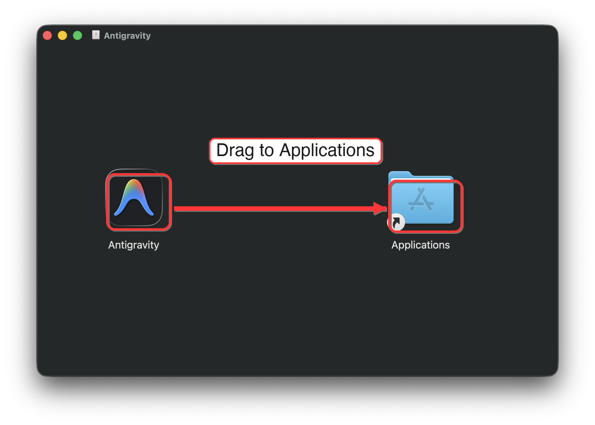

初回起動したら、Welcome画面で `Next` を押します。

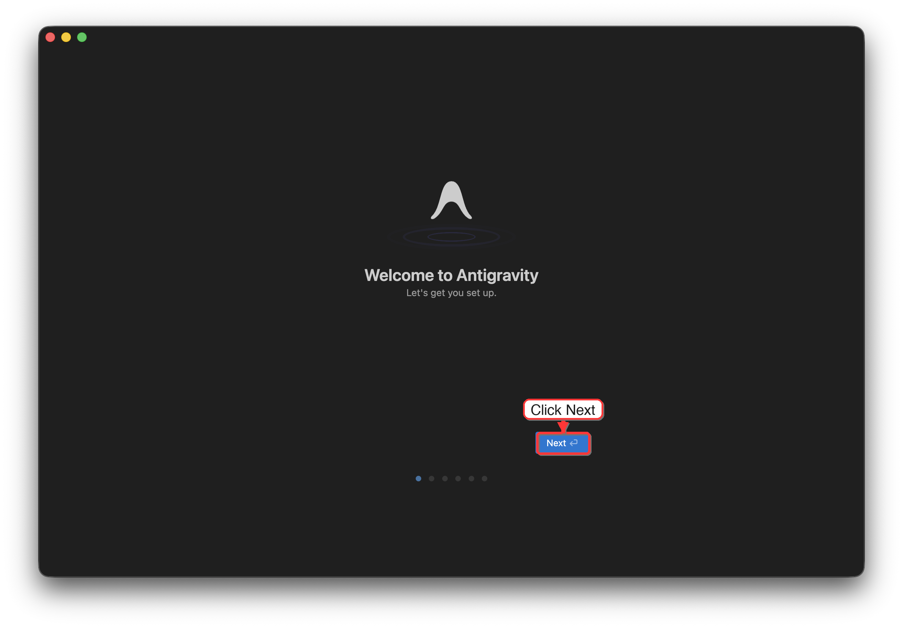

テーマ選択では `Dark Modern` のまま `Next` を押します。別のテーマを選んでも、このワークショップの手順には影響しません。

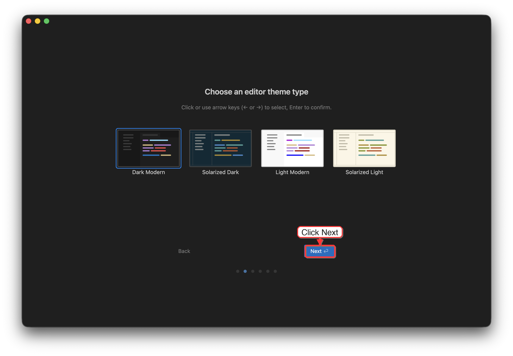

利用方法の選択では `Review-driven development` のまま `Next` を押します。

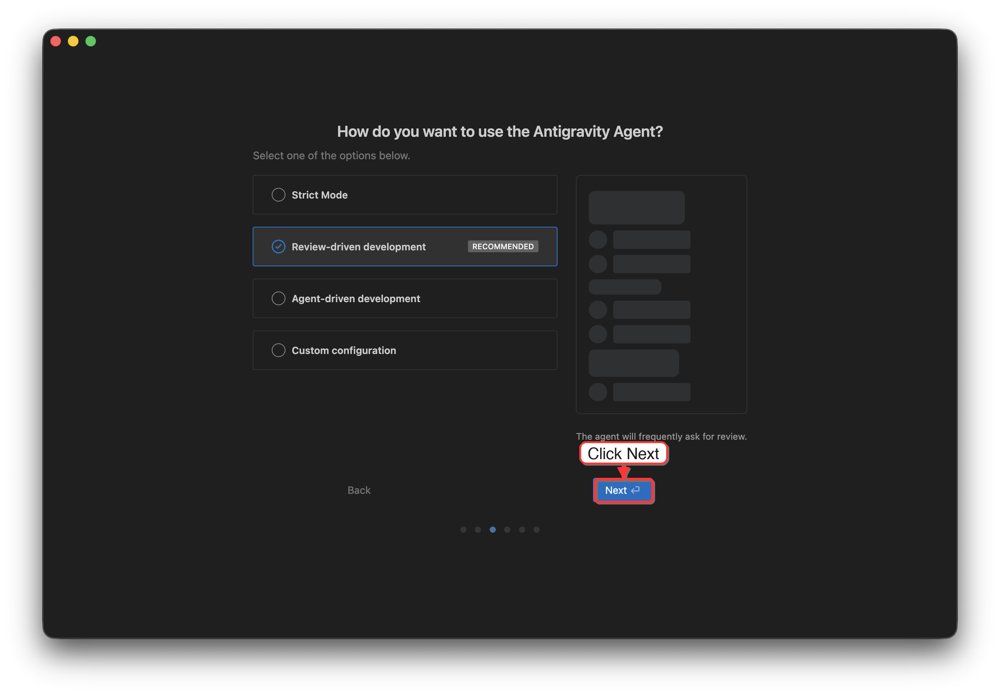

エディタ設定では `Normal`、`Recommended`、`Install` のまま `Next` を押します。

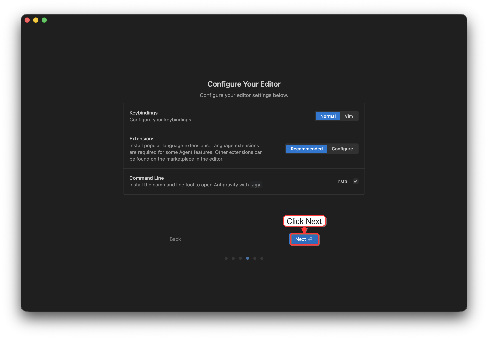

`Sign in with Google` を押して、Googleアカウントでサインインします。

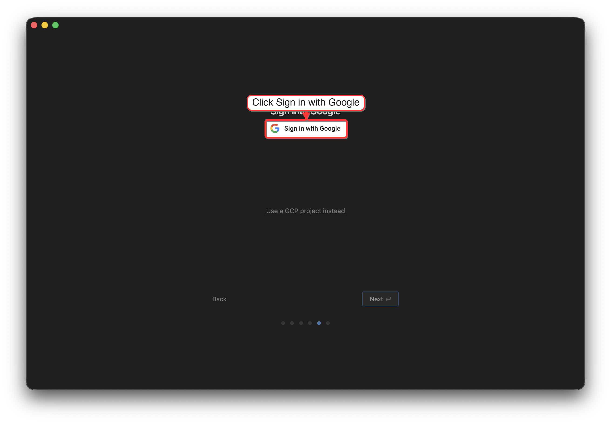

利用規約を確認します。1つ目のチェックが入っていることを確認して、`Next` を押します。

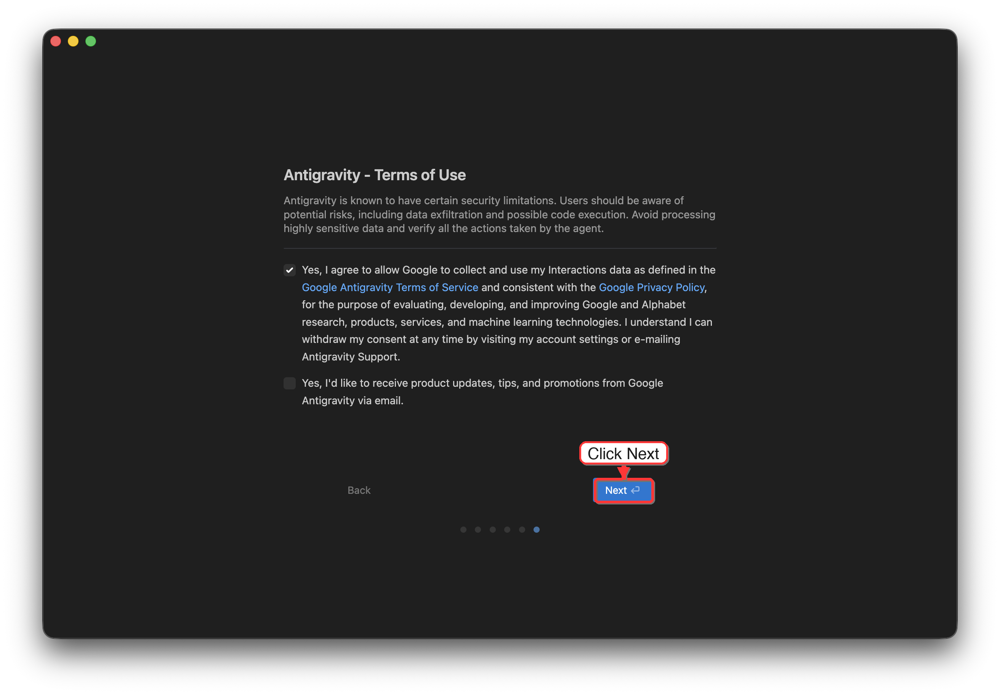

セットアップが終わったら、まだリポジトリをcloneしていない場合は `Clone Repository` を押します。

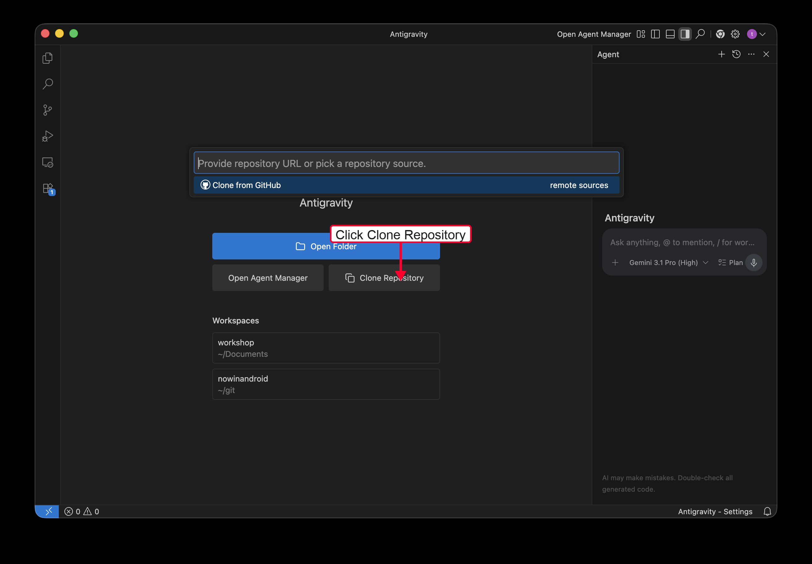

表示された入力欄に、次のURLを入力してcloneします。

```text
git@github.com:takahirom/android-agent-tools-workshop.git
```

フォルダを開いたあと、信頼確認のダイアログが表示された場合は、対象フォルダがこのワークショップ用リポジトリであることを確認して `Yes, I trust the authors` を押します。

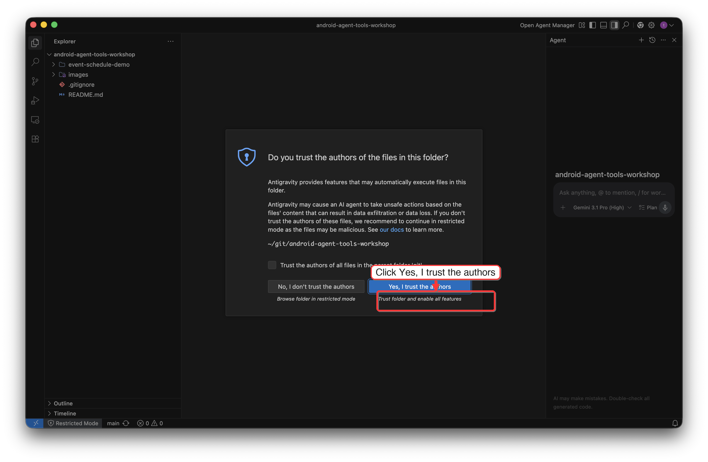

## ワークショップ中のAntigravity設定

### クォータを使い切らないようにする

Antigravityは無料アカウントでも利用できますが、使用量には制限があります。制限に達すると、しばらくエージェントを使えなかったり、モデルを切り替える必要が出たりする場合があります。

ワークショップ中は、クォータ（利用量の上限）を使い切らないように、依頼を小さく分けて進めます。調査、実装、確認、README修正を一度にまとめて依頼すると消費が大きくなりやすいので、必要な作業だけを順番に依頼します。

制限やプランの最新情報は、[Antigravity plans](https://antigravity.google/docs/plans) を確認してください。

### Planを無効にする

`Plan` は、すぐにファイル変更を始めず、先に作業方針や変更対象を整理して確認するためのモードです。

今回のワークショップでは必要ないので、入力欄の `Plan` にある `x` ボタンを押して無効にして進めます。

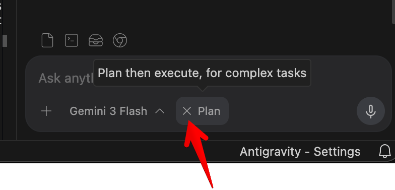

### Gemini 3 Flashで進める

このワークショップでは、クォータを使い切らないように `Gemini 3 Flash` を推奨します。

エラーが続く場合や、モデルの空き容量が不足している場合は、入力欄のモデル名を押して別のモデルに切り替えてみましょう。

`Failed to send` のようにチャット送信自体が失敗する場合は、一度Antigravityからログアウトし、再度Googleアカウントでサインインしてから試してください。

## 1. Android CLIとAndroid Skillsを準備しよう

ここでは、Android CLIとAndroid Skillsを使える状態にします。

まずAndroid Developersの [Agent tools and resources](https://developer.android.com/tools/agents) を開きます。ページにAndroid CLIのインストールコマンドが表示されるので、そのコマンドをコピーします。

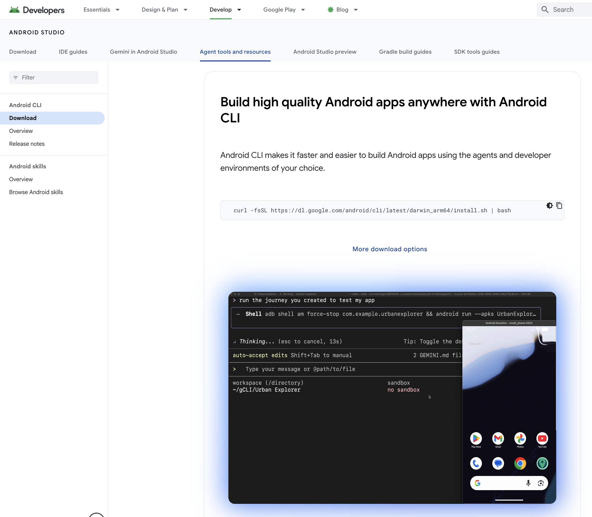

画面右上のTerminalアイコンを押して、Terminalを開きます。

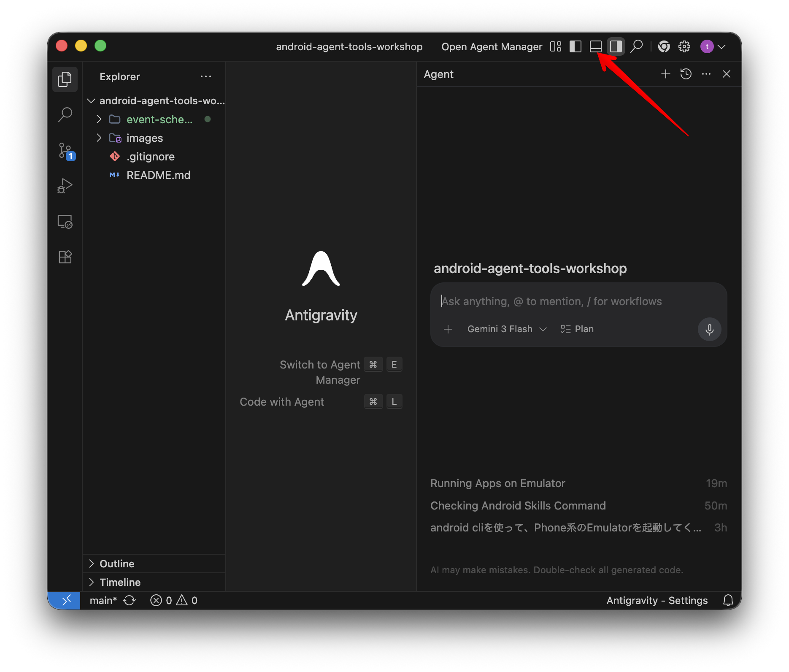

Terminalに、公式サイトでコピーしたインストールコマンドを貼り付けて実行します。

インストール後、Android CLIを更新して初期化します。

```bash
android update
android init
```

そのあと、Android CLIとSkillsが使えるか確認します。

```bash
android --version
android skills list
```

<details>
<summary>`android` コマンドが見つからない場合</summary>

`android` コマンドが見つからない場合や、`android update` / `android init` / `android skills list` が失敗する場合は、エージェントにセットアップを依頼します。

依頼文の例です。

```text
この環境でAndroid CLIとAndroid Skillsを使える状態にしてください。
android update、android init、android --version、android skills list が実行できることを確認してください。
必要な初期化があれば実行してください。
```

エージェントは必要に応じて、次のようなコマンドを使います。

```bash
android update
android init
android skills list
```

</details>

`android skills list` でSkillの一覧が表示されればOKです。

## 2. AntigravityでEmulatorを起動してみよう

まず、AntigravityでエージェントにAndroid CLIを使ってEmulatorを起動してもらいます。手元に使えるEmulatorがない場合は、作成から依頼します。

> [!IMPORTANT]
> Windowsで参加している場合は、Android CLIのEmulator作成・起動コマンドではなく、先に [WINDOWS_EMULATOR_SETUP.md](WINDOWS_EMULATOR_SETUP.md) の手順でEmulatorを起動してください。
> Emulatorが起動してdevice serialを確認できたら、この章の残りは飛ばして「3. Emulatorでアプリを起動してみよう」へ進みます。

右側のAgent入力欄に依頼文を入力します。

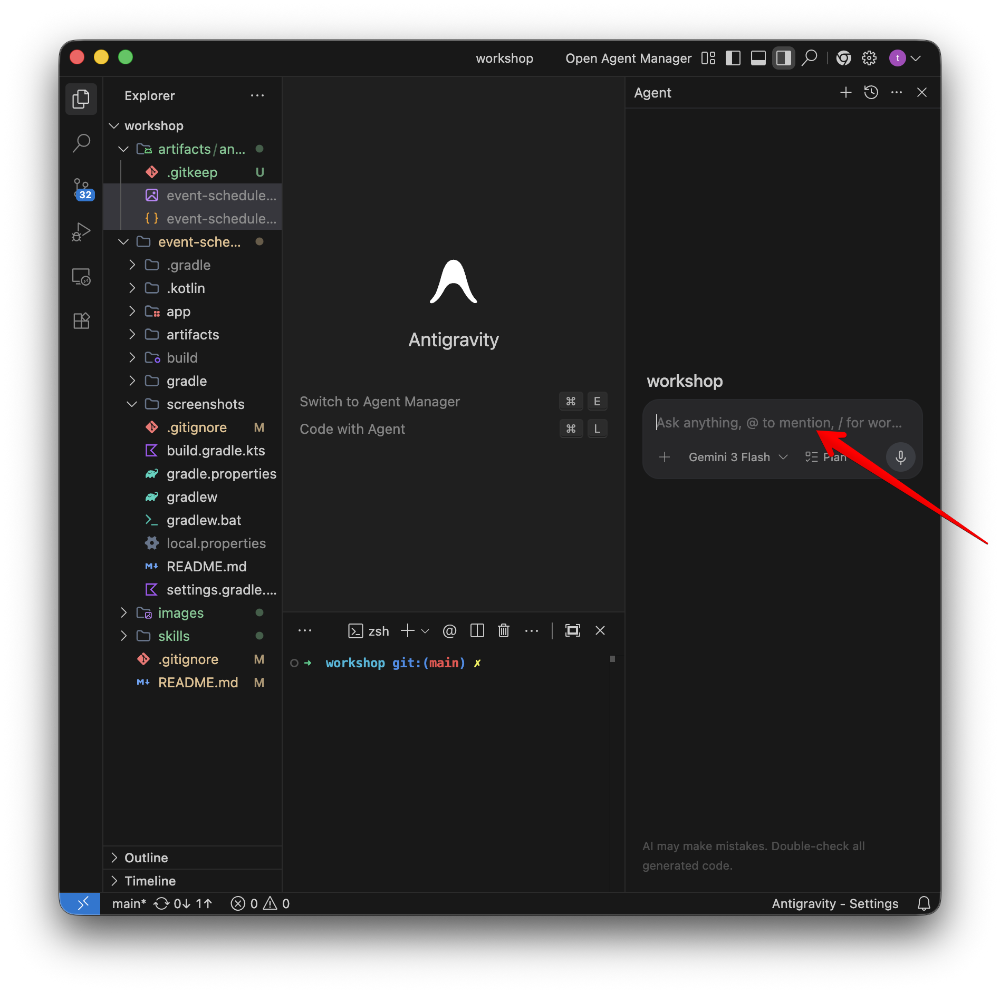

依頼文の例です。

```text
Android CLIを使って、Phone系のEmulatorを起動してください。
Android SDK自体が入っていない場合は、必要なAndroid SDKもAndroid CLIを使ってインストールしてください。
必要ならEmulatorを作成してください。
起動後、adb devices -l で device 状態になっていることを確認してください。
```

エージェントがコマンドを実行する前に、確認を求められることがあります。`Run` を押す前に、どのコマンドを実行しようとしているかを観察してみましょう。

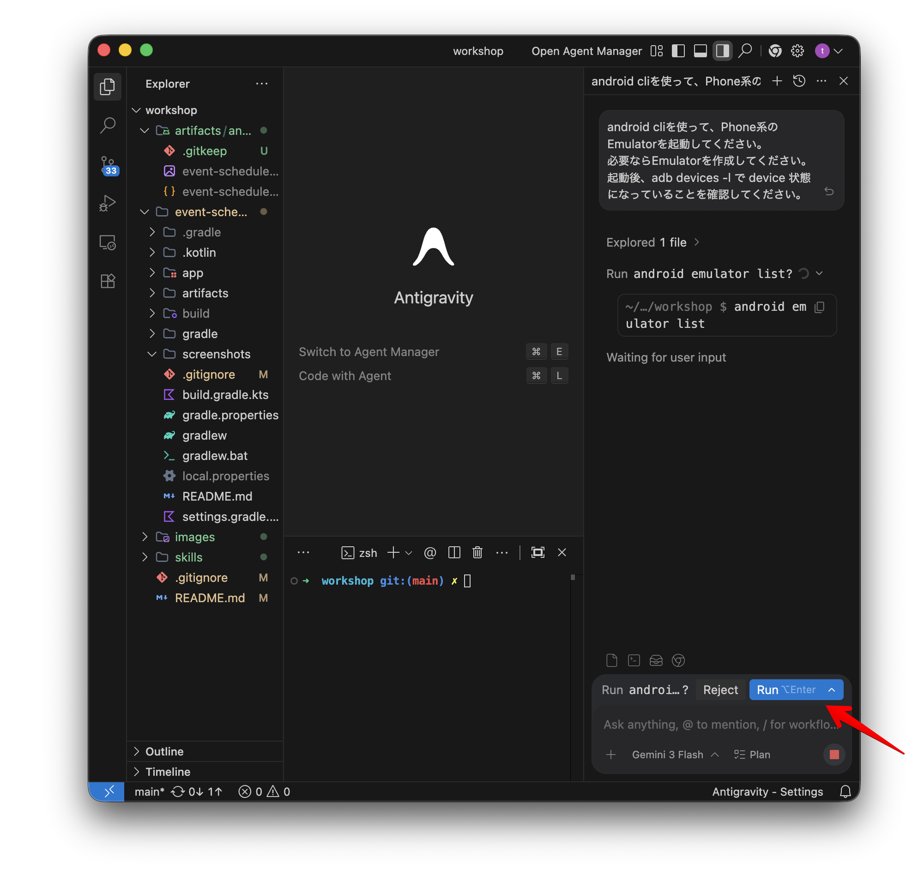

この依頼を実行したあとに `Agent terminated due to error` が表示された場合、モデルの空き容量が不足している可能性があります。`Retry` しても同じ表示になる場合は、入力欄のモデル名を押して `Gemini 3 Flash` など別のモデルに切り替えてから、もう一度実行してください。

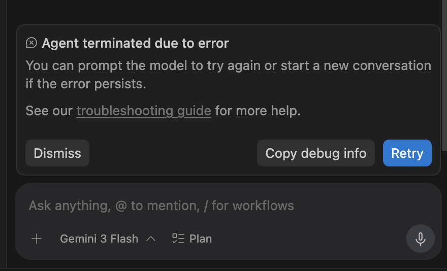

エージェントは必要に応じて、次のようなコマンドを使います。

```bash
android emulator list
android emulator create --profile=medium_phone
android emulator start --cold <AVD_NAME>
adb devices -l
```

`emulator-5554 device ...` のように `device` 状態のEmulatorが表示されればOKです。表示されたserialは、このあとの `--device=<DEVICE_SERIAL>` に指定します。以降の例では `<DEVICE_SERIAL>` と書きます。

## 3. Emulatorでアプリを起動してみよう

ここでは、エージェントにデバッグアプリのビルド、インストール、起動を依頼します。

依頼文の例です。

```text
event-schedule-demo のデバッグアプリをビルドして、Emulatorにインストールし、アプリを起動してください。
デバイスserialは、前の手順で確認したEmulatorのserialを使ってください。
```

エージェントは必要に応じて、次のようなコマンドを使います。

```bash
cd event-schedule-demo
./gradlew :app:assembleDebug
android run --apks=app/build/outputs/apk/debug/app-debug.apk --device=<DEVICE_SERIAL>
```

Emulatorでアプリが起動しているのが確認できればOKです。

## 4. AIがどうやってアプリを見ているか理解しよう

ここでは、AntigravityのTerminalでAndroid CLIを自分で実行してみます。エージェントも同じようにCLIの出力、スクリーンショット、layout JSONを見ながらAndroidアプリを確認します。

Terminalにコマンドを入力して実行します。

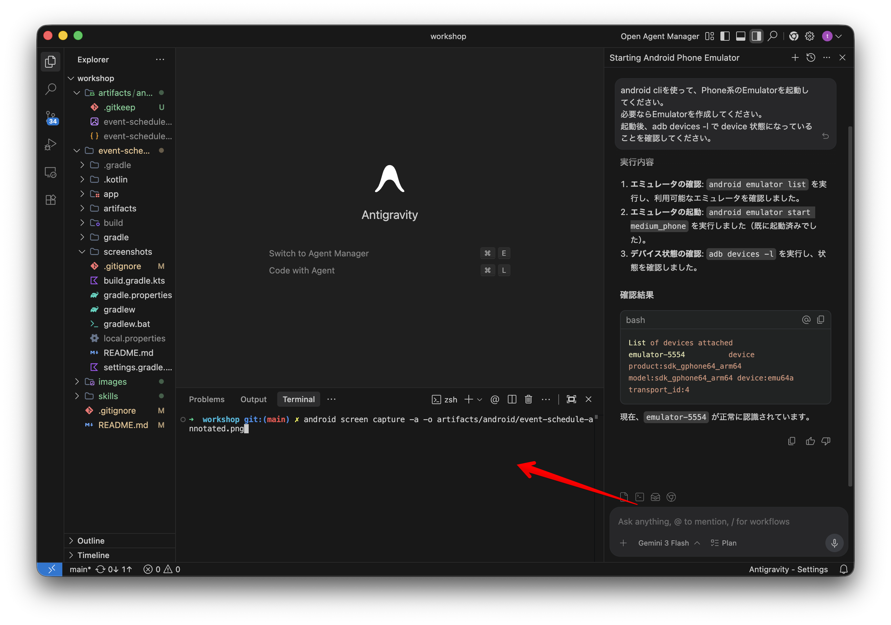

起動済みのアプリに対して、Android CLIが画面をどう見ているかを確認します。ここは参加者が手で実行して、注釈付きPNGとlayout JSONが生成されることを確かめる時間にします。

リポジトリルートで実行します。macOS / Linux の例です。

```bash
android screen capture -a -o artifacts/android/event-schedule-annotated.png
android layout --pretty -o artifacts/android/event-schedule-layout.json
```

Windows PowerShell の例です。

```powershell
android screen capture -a -o artifacts/android/event-schedule-annotated.png
android layout --pretty -o artifacts/android/event-schedule-layout.json
```

`screen capture -a` は、UI要素に番号付きの枠を付けたPNGを出力します。`layout` は、画面上のテキスト、content description、座標、クリック可能かどうかなどをJSONで出力します。

必要なら、注釈付き画像の番号を座標に変換できます。

```bash
android screen resolve --screenshot=artifacts/android/event-schedule-annotated.png --string="tap #1"
```

ホーム画面で実行すると注釈が多くなり、何を見ているのか分かりにくくなります。このワークショップでは、アプリを起動してから `screen capture -a` と `layout` を実行します。

通常のスクリーンショットでは、次のように画面上部のタイトルがstatus barに近すぎたり、画面下部のnavigation bar周りに余白が足りなかったりすることが確認できます。

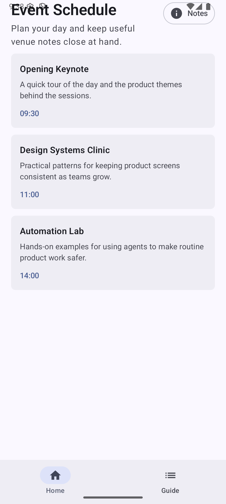

これはEdge-to-Edgeと呼ばれる、画面の端までアプリを描画する表示に対して、レイアウト側の対応が不十分な状態です。このワークショップでは、この問題に対応していきます。

## 5. Edge-to-Edge Skillを確認しよう

このワークショップで使うEdge-to-Edge用のSkillを探します。

```bash
android skills find edge
```

`edge-to-edge` が見つかったら、このリポジトリで使えるようにします。

```bash
android skills add --skill=edge-to-edge --project=.
```

## 6. Knowledge Baseで公式情報を見てみよう

Android CLIには、Android公式ドキュメントを検索するKnowledge Baseコマンドがあります。修正作業に入る前に、Edge-to-EdgeとWindowInsetsの情報を検索してみます。

```bash
android docs search "Edge-to-edge Compose WindowInsets Android 15"
```

検索結果にEdge-to-EdgeやWindowInsetsに関する `kb://android/...` のURLが出たら、内容を取得します。

```bash
android docs fetch <KB_URL>
```

ここで見たいのは、細かいAPIを覚えることではありません。エージェントが作業前に公式情報へアクセスし、前提条件や未対応機能を確認できることです。

## 7. Edge-to-Edgeの未対応箇所を修正しよう

ここからはエージェントに作業させます。依頼文の例です。

```text
event-schedule-demo の Edge-to-Edge 対応を完成させてください。
公式の edge-to-edge skill と Android Knowledge Base の情報に従ってください。
既存の画面遷移や操作感は変えず、システムバーにUIが被らないようにしてください。
```

修正中に主に見るファイルはこのあたりです。

- `event-schedule-demo/app/src/main/java/com/example/eventschedule/MainActivity.kt`
- `event-schedule-demo/app/src/main/java/com/example/eventschedule/Navigation.kt`
- `event-schedule-demo/app/src/main/java/com/example/eventschedule/ui/main/MainScreen.kt`

## 8. 発展: AIにAndroid CLIで実機操作させて、確認してもらえるスキルを用意しよう

普通は、変更後にアプリが本当に動くかを自分で確認します。ただし、毎回手でEmulatorを起動して、画面を触って、ログを見るのは面倒です。

ここでは発展項目として、Android CLIでアプリをビルド、起動、操作、確認するためのAgent Skillを用意します。Antigravityのワークスペース用Skillは `.agents/skills/<skill-name>/SKILL.md` に置きます。一度用意しておくと、今後のAndroidアプリ開発でも変更後の確認作業に使い回せます。

このリポジトリには、書き始めやすいように `.agents.template` を用意しています。すでに `edge-to-edge` Skillを追加している場合は `.agents` ディレクトリが存在するため、リネームではなく、エージェントにテンプレートをコピーしてもらいます。

依頼文の例です。

```text
.agents.template/skills/android-app-qa を .agents/skills/android-app-qa にコピーしてください。
既存の .agents ディレクトリや edge-to-edge Skill は残してください。
```

コピー後、次のファイルを開いて本文を編集します。

```text
.agents/skills/android-app-qa/SKILL.md
```

たとえば、次のような内容を書きます。

```text
確認手順:
1. 対象アプリ、ビルドコマンド、APKパス、device serialを確認する
2. ビルドとテストを実行する
3. Android CLIでEmulatorへインストールして起動する
4. ユーザーから渡された確認シナリオに沿ってUIを操作する
5. 操作したすべての画面で、スクリーンショットとlayout JSONを保存する
6. 実行したコマンド、確認した画面、失敗内容、未確認項目を短く報告する

守ること:
- 固定のdevice serialを前提にしない
- 失敗した場合は、失敗したコマンドとエラー内容を報告する
```

作成後は、新しい会話で次のように確認を依頼します。

```text
android-app-qa Skillを使って、Android CLIで event-schedule-demo を確認してください。
各画面のスクリーンショットとlayout JSONを保存し、status bar / navigation bar と主要UIの重なりも確認してください。
```

この発展項目で見たいのは、「Android CLIを使った実機操作と確認作業もエージェントに任せられるか」です。Edge-to-Edgeの最終判断はスクショを見て人間も確認しますが、ビルド、起動、操作、証跡保存を分担できると、実際の開発作業に近づきます。

### 時間が余ったら

- **確認結果をMarkdownレポートとして保存してもらう**
  エージェントが `qa-result/YYYY-MM-DD-001/RESULT.md` に結果を書き、スクリーンショットを `qa-result/YYYY-MM-DD-001/images/` に保存するように、Skillへ手順を追加します。

- **ログを入れて、本当に変更箇所が実行されているか確認してもらう**
  エージェントが変更したComposableや処理に一時的なログを入れ、Android CLIで絞り込んだログを確認する手順をSkillへ追加します。画面上の見た目だけでなく、変更したコードが実際に通っていることを確認できます。

- **ユーザースコープのSkillにして、他のプロジェクトでも使えるようにする**
  ワークスペース用の `.agents/skills/` ではなく、ユーザー用の `~/.gemini/antigravity/skills/` に置くと、他のワークスペースでも同じSkillを使えます。詳しくは [Antigravity Skills](https://antigravity.google/docs/skills) を参照してください。

## 9. ふりかえり

このワークショップで重視するのは、WindowInsets APIを暗記することではありません。

- 公式Skillが修正方針を確認できるか
- Knowledge Baseで公式ドキュメントを根拠にできるか
- エージェントが既存挙動を壊さずに変更できるか
- QA担当に確認作業を委任できるか
- ビルド、テスト、Emulator確認まで進められるか
- 知らない技術領域でも、確認可能な形で作業を任せられるか

ここまでできればワークショップとしては完了です。時間が余った場合は、どの画面でどのinsetが必要だったかを見直します。

## 参考資料

- [Antigravity公式サイト](https://antigravity.google/)
- [Antigravity公式ドキュメント](https://antigravity.google/docs)
- [Antigravity plans](https://antigravity.google/docs/plans)
- [Getting Started with Google Antigravity Codelab](https://codelabs.developers.google.com/getting-started-google-antigravity?hl=ja)
- [antigravity-hands-on-gdg-sapporo](https://github.com/yanzm/antigravity-hands-on-gdg-sapporo)
