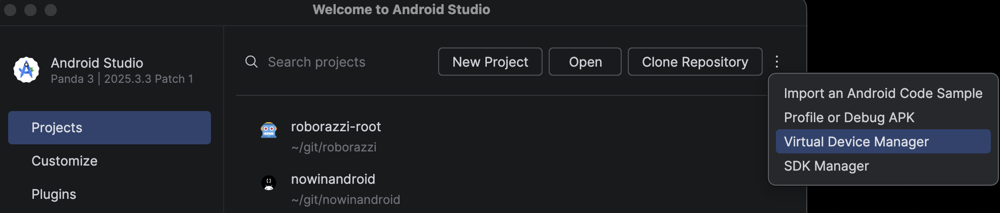
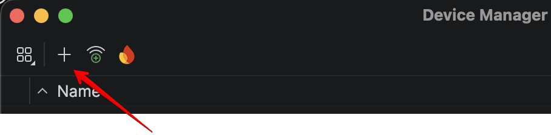
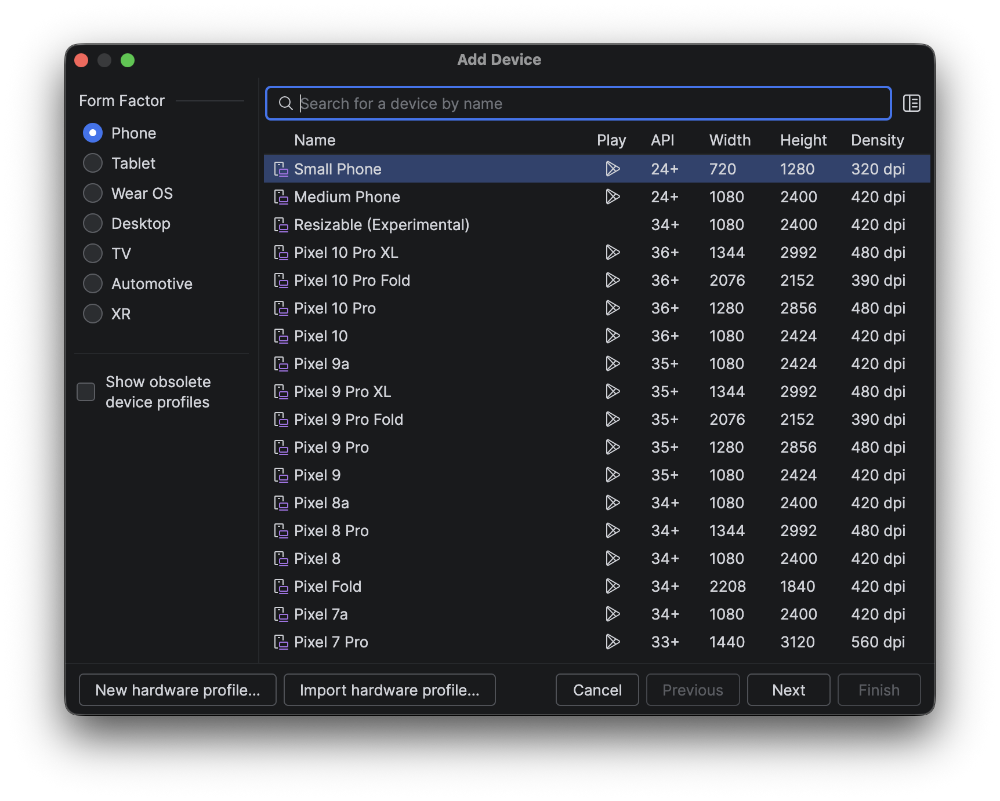
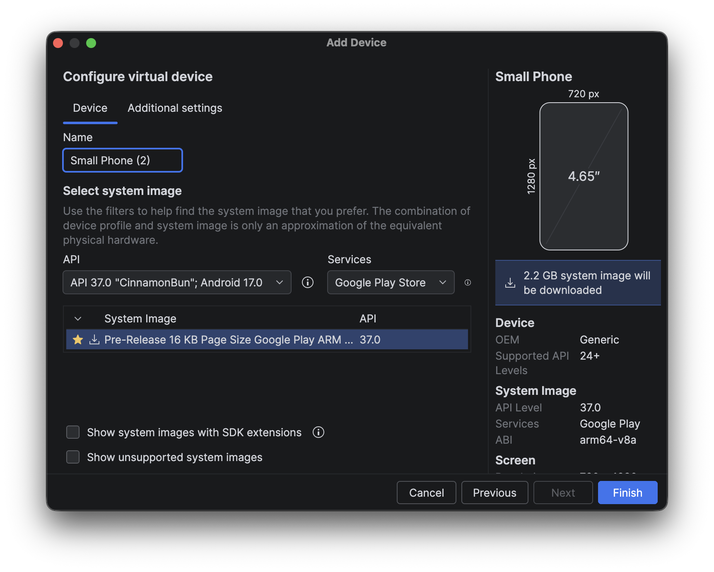

# Windows Emulator Setup

このファイルは、Windowsでワークショップに参加する人向けの補助手順です。

ここで行うことは、次の2つです。

- Android StudioでAndroid Emulatorを起動する
- Windowsで `android` コマンドを使えるようにする

ここまでできたら、本編READMEに戻ってAntigravityから作業を続けます。

> Status:
> この手順は公式ドキュメントに基づくWindows向け補助手順です。
> 作者の手元ではWindows実機で未検証です。
> Windows環境で確認できた方は、IssueまたはPRでフィードバックしてください。

## Android Emulatorのセットアップ

現時点では、Android CLI の `android emulator` コマンドは Windows で無効になっています。
そのため、WindowsではAndroid Studio の Device Manager でEmulatorを作成・起動します。

### 1. Android Studioを用意する

Android Studioをまだインストールしていない場合は、公式ページからインストールしてください。

- [Download Android Studio](https://developer.android.com/studio)

インストール後、Android Studioを起動します。

初回起動時にセットアップ画面が表示された場合は、表示される案内に従って進めます。Android SDKやEmulator関連のコンポーネントをインストールする画面が出た場合は、選択されたまま進めてください。

### 2. Device Managerを開く

Android StudioのWelcome画面が表示されている場合は、右上の `...` メニューから `Virtual Device Manager` を開きます。

以下はmacOS版Android Studioの例ですが、Windowsでも同じようにWelcome画面のメニューから `Virtual Device Manager` を開きます。



すでにAndroid Studioでプロジェクトを開いている場合は、次の順に開きます。

```text
View > Tool Windows > Device Manager
```

Device Managerは、Android StudioでEmulatorを作成・起動するための画面です。

### 3. Phone系Emulatorを作成する

Device Managerに使えるEmulatorがまだない場合は、新しいVirtual Deviceを作成します。

Device Managerで `+` または `Create Virtual Device` を押します。

以下はmacOS版Android Studioの例ですが、Windowsでも同じようにDevice Managerの `+` からVirtual Deviceを作成します。



選択する内容の目安です。

- Form factor: Phone
- Device: Pixel系、または標準的なPhoneデバイス
- System Image: Android 15 / API 35 以上
- Image type: Google APIs または Google Play

Device選択画面では、左側で `Phone` を選び、一覧からPhone系のデバイスを選んで `Next` を押します。



次の画面でSystem Imageを選びます。
画像ではAPI 37のPre-Releaseが表示されていますが、このワークショップではAndroid 15 / API 35 以上の通常のGoogle APIsまたはGoogle PlayのSystem Imageを選んでください。



このワークショップではEdge-to-Edgeの挙動を確認したいため、Android 15 / API 35 以上のEmulatorを推奨します。

System Imageに `Download` と表示されている場合は、Android Studioの案内に従ってダウンロードしてください。ダウンロードが終わったら、`Next` や `Finish` を押して作成を完了します。

すでにAndroid 15 / API 35 以上のPhone系Emulatorがある場合は、新しく作らずにそれを使って構いません。

### 4. Emulatorを起動する

Device Managerで、使うEmulatorの再生ボタンを押して起動します。

Emulatorのホーム画面が表示されるまで待ちます。起動には数分かかることがあります。

## androidコマンドをPATHに追加する

本編READMEに戻ったあと、AntigravityのTerminalで `android` コマンドを実行します。
Windowsでは、Android CLIの `android.exe` が入っているフォルダをユーザー環境変数の `Path` に追加します。

まず、Android CLIの `android.exe` がどこにあるか確認します。インストール方法や環境によって異なりますが、次のような場所にあることがあります。

```text
C:\Users\<Windowsのユーザー名>\AppData\AndroidCLI\android.exe
```

`Path` に追加するのは `android.exe` そのものではなく、`android.exe` が入っているフォルダです。

```text
C:\Users\<Windowsのユーザー名>\AppData\AndroidCLI
```

設定手順です。

1. Windowsの検索で `環境変数` と入力します。
2. `システム環境変数の編集` を開きます。
3. `環境変数...` を押します。
4. `ユーザー環境変数` の `Path` を選び、`編集...` を押します。
5. `新規` を押し、`android.exe` が入っているフォルダを追加します。
6. `OK` を押して画面を閉じます。
7. AntigravityのTerminalを開き直します。
8. 次のコマンドで確認します。

```powershell
android --version
android skills list
```

`android` コマンドが実行できればOKです。

> Note:
> コマンドとして `android` を実行できるようにするには、`Path` にフォルダを追加します。
> `android` という名前の環境変数を作るだけでは、通常は `android` コマンドとして実行できません。

## ここまでできたらREADMEに戻る

このファイルで行うWindows固有の作業はここまでです。

本編READMEの「3. Emulatorでアプリを起動してみよう」に戻って進めてください。

以降のビルド、アプリ起動、スクリーンショット取得、layout JSON取得は、本編READMEの手順でAntigravityから実行します。

複数のEmulatorや実機を同時に接続している場合だけ、エージェントがdevice serialの指定を求めることがあります。その場合は、エージェントの案内に従って対象のEmulatorを指定してください。

## 参考資料

- [Create and manage virtual devices](https://developer.android.com/studio/run/managing-avds)
- [Android Debug Bridge](https://developer.android.com/studio/command-line/adb)
- [Run apps on the Android Emulator](https://developer.android.com/studio/run/emulator)
